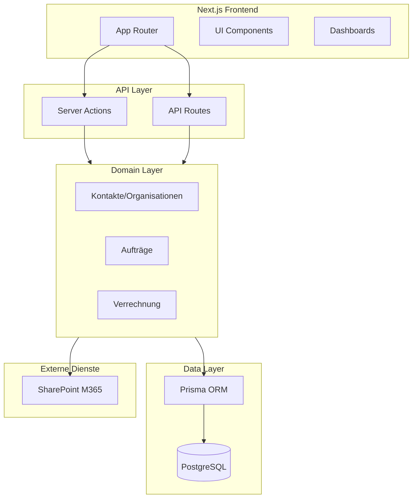
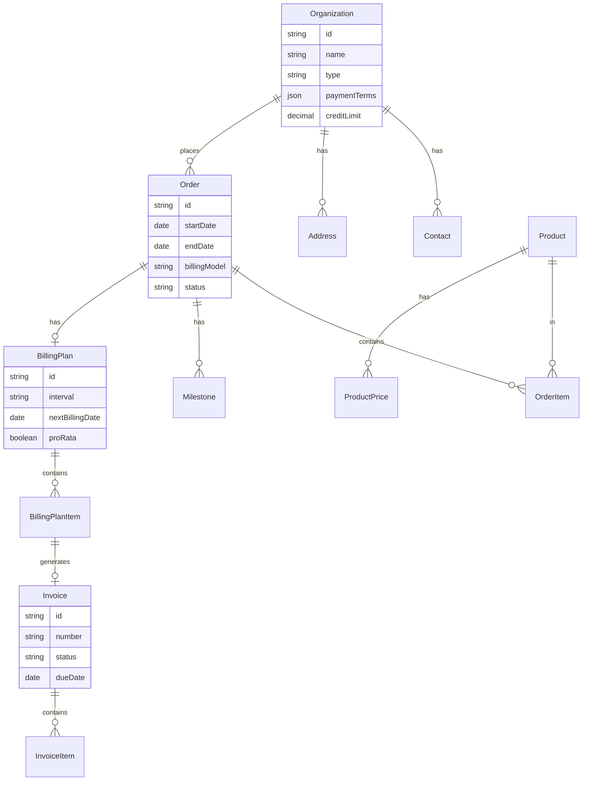

# Zuraio ERP – Implementierungsplan

## Technologie-Stack


| Schicht   | Technologie                                                             |
| --------- | ----------------------------------------------------------------------- |
| Frontend  | Next.js 14+ (App Router), React, Tailwind CSS, shadcn/ui                |
| Backend   | Next.js API Routes / Server Actions                                     |
| i18n      | next-intl oder react-i18next; separate Sprachdateien (JSON)             |
| Design    | Exakte Übernahme des vorgegebenen Layouts (siehe unten)                 |
| ORM & DB  | Prisma, PostgreSQL                                                      |
| Auth      | NextAuth.js oder Auth.js (Rollen, Berechtigungen)                       |
| PDF       | react-pdf oder @react-pdf/renderer für Rechnungen                       |
| Dokumente | Microsoft SharePoint (via Graph API), @microsoft/microsoft-graph-client |


---

## Projektparameter und festgelegte Entscheidungen

### Mandant und Daten


| Thema           | Entscheidung                                                                                |
| --------------- | ------------------------------------------------------------------------------------------- |
| Mandant         | Single-Tenant (eine Firma)                                                                  |
| Datenmigration  | Keine – Start von Null                                                                      |
| Kontaktstruktur | Organisation → Kontakte (Personen); kompatibel mit Salesforce, HubSpot, Dynamics, M365, ERP |


### Währung und Steuern


| Thema   | Entscheidung            |
| ------- | ----------------------- |
| Währung | CHF (Schweizer Franken) |
| Steuern | Schweizer MWST-Logik    |


### Hosting und Deployment


| Thema       | Entscheidung                                                                     |
| ----------- | -------------------------------------------------------------------------------- |
| Hosting     | Railway (PaaS)                                                                   |
| Deployment  | GitHub-Integration: Push auf main → automatisches Deploy                         |
| Implikation | Next.js, PostgreSQL-Add-on, Cron für Batch-Jobs; Dokumente auf SharePoint (M365) |


### Integrationen (Priorität für MVP)


| Priorität | Integration                | Hinweise                                                |
| --------- | -------------------------- | ------------------------------------------------------- |
| 1         | Buchhaltung                | Export Buchungssätze oder API-Anbindung an Finanzsystem |
| 2         | E-Mail-Versand             | Rechnungen, Mahnungen; Vorlagen, optional Tracking      |
| 3         | Bankimport                 | CAMT-Format, automatische Zuordnung von Zahlungen       |
| 4         | Microsoft 365 / SharePoint | Dokumentenspeicherung (Verträge, NDAs, Offerten)        |


**Offene Punkte (vor Implementierung klären):**

- Ziel-Buchhaltungssystem (Abacus, Bexio, Lexware, DATEV, eigenes)?
- E-Mail-Provider (SendGrid, Resend, SMTP)?

### Mehrsprachigkeit (verbindlich)


| Thema         | Vorgabe                                                            |
| ------------- | ------------------------------------------------------------------ |
| Anforderung   | Vollständige Mehrsprachigkeit durch die gesamte Software           |
| Sprachdateien | Separat abgespeichert (z.B. JSON pro Sprache)                      |
| Startsprachen | Deutsch (de), Englisch (en), Brasilianisches Portugiesisch (pt-BR) |
| Umfang        | UI, Labels, Meldungen, E-Mails, PDFs, Fehlermeldungen              |


### Sicherheit (verbindlich)

Vollständiges Sicherheitskonzept (siehe Abschnitt «Sicherheitskonzept»):

- **Authentifizierung:** Auth.js, Passwort-Hashing, Session-Timeout, optional 2FA, Account-Sperre
- **Autorisierung:** Rollenmodell, Prüfung in jeder Server Action, Rechte bis Auftragsebene
- **Datensicherheit:** HTTPS, keine Klartext-Secrets, verschlüsselte DB-Verbindung
- **Anwendung:** SQL-Injection/XSS/CSRF-Schutz, Input-Validierung, Rate Limiting, sichere Uploads
- **Audit:** Audit Trail, Login-Log, Protokollierung sensibler Aktionen, DSG/GDPR-konform

### Weitere Konventionen


| Thema                          | Vorgabe                  |
| ------------------------------ | ------------------------ |
| Zeiterfassung                  | Phase 2 (nicht im MVP)   |
| Vier-Augen-Freigabe Rechnungen | Optional, konfigurierbar |


---

## Mehrsprachigkeit (i18n) – Architektur

### Struktur der Sprachdateien

```
locales/
├── de/
│   ├── common.json      # Allgemeine UI-Texte, Navigation, Buttons
│   ├── contacts.json    # Kontakte-Modul
│   ├── orders.json      # Aufträge-Modul
│   ├── billing.json     # Rechnungen, Mahnwesen
│   ├── products.json    # Produkte, Preislisten
│   └── errors.json      # Fehlermeldungen
├── en/
│   └── ... (gleiche Struktur)
└── pt-BR/
    └── ... (gleiche Struktur)
```

### Implementierung

- **Frontend:** Alle sichtbaren Texte über Übersetzungsschlüssel (z.B. `t('contacts.title')`), keine Hardcodings
- **Backend:** E-Mail-Vorlagen, PDF-Texte, Systemmeldungen ebenfalls sprachabhängig (Locale aus User/Request)
- **Datenbank:** Stammdaten mit sprachspezifischen Bezeichnungen optional (z.B. Produktnamen) – falls nötig, eigene Tabelle oder JSON-Spalte
- **Sprachumschaltung:** Im Header (Globus-Icon) oder Benutzerprofil; Persistenz in Session/User-Einstellung

### Abdeckung


| Bereich                                 | Mehrsprachig |
| --------------------------------------- | ------------ |
| Navigation, Menüs, Buttons              | Ja           |
| Formularlabels, Platzhalter             | Ja           |
| Validierungs- und Fehlermeldungen       | Ja           |
| E-Mail-Vorlagen (Rechnungen, Mahnungen) | Ja           |
| PDF-Rechnungen                          | Ja           |
| Benachrichtigungen, Alarme              | Ja           |


---

## Dokumentenspeicherung (SharePoint / Microsoft 365)

Die Dokumente (Verträge, NDAs, Offerten, Bestellungen, Korrespondenz) werden in **SharePoint** abgelegt – über den bestehenden M365-Account der Firma.

### Voraussetzungen

- Microsoft 365 Tenant der Firma
- SharePoint-Dokumentenbibliothek (z.B. «Zuraio ERP» oder dedizierte Site)
- Azure AD App Registration für die Anwendung

### Technische Umsetzung


| Komponente            | Beschreibung                                     |
| --------------------- | ------------------------------------------------ |
| **API**               | Microsoft Graph API                              |
| **Client**            | `@microsoft/microsoft-graph-client`              |
| **Authentifizierung** | OAuth2 (Client Credentials oder App-only)        |
| **Berechtigungen**    | `Sites.ReadWrite.All` oder `Files.ReadWrite.All` |


### Ordnerstruktur in SharePoint

```
Zuraio ERP (Dokumentenbibliothek)/
├── Organisationen/
│   └── {organizationId}/
│       ├── Vertraege/
│       ├── NDAs/
│       └── Korrespondenz/
└── Auftraege/
    └── {orderId}/
        ├── Offerten/
        └── Bestellungen/
```

### Datenmodell (Document)


| Feld                        | Beschreibung                                |
| --------------------------- | ------------------------------------------- |
| `id`                        | Prisma-ID                                   |
| `organizationId`, `orderId` | Verknüpfung                                 |
| `type`                      | CONTRACT, NDA, OFFER, ORDER, CORRESPONDENCE |
| `fileName`                  | Originaldateiname                           |
| `sharePointDriveId`         | SharePoint Drive-ID                         |
| `sharePointItemId`          | SharePoint Item-ID (für Abruf)              |
| `sharePointWebUrl`          | Direktlink (optional)                       |
| `mimeType`, `size`          | Metadaten                                   |
| `uploadedAt`, `uploadedBy`  | Audit                                       |


### Setup-Schritte

1. Azure AD App im M365 Admin Center / Azure Portal anlegen
2. Berechtigungen konfigurieren, Admin-Einwilligung erteilen
3. Client ID, Client Secret, Tenant ID in Railway-Umgebungsvariablen setzen
4. SharePoint-Dokumentenbibliothek anlegen, Site-ID/Drive-ID ermitteln
5. Upload/Download-Logik in der App implementieren

---

## Architektur-Übersicht




---

## Frontend-Design (verbindliche Spezifikation)

Das Layout ist **genau** wie in der Vorlage umzusetzen. Abweichungen nur nach expliziter Freigabe.

### Layout-Referenz (Screenshot)

Design-Layout – Vorlage für Zuraio ERP

*Abbildung: Layout-Vorlage (AI-Hub) – nur Struktur, Farben und Abstände übernehmen. Der **Inhalt der Sidebar** entspricht den ERP-Hauptmenüpunkten (siehe unten), nicht den AI-Hub-Einträgen (Pinwand, Prompts, Spaces, Chats).*

### Layout-Struktur

- Einspaltige Webanwendung
- Feste Kopfzeile (Header) oben
- Vertikale Navigationsleiste (Sidebar) links, fest
- Hauptinhaltsbereich rechts, flexibel

### 1. Header


| Eigenschaft  | Wert                                                                                                                    |
| ------------ | ----------------------------------------------------------------------------------------------------------------------- |
| Hintergrund  | `#FFFFFF` (Reinweiß)                                                                                                    |
| Linke Seite  | **«Zuraio ERP»** (dunkelgrau, ca. 18px, fett)                                                                           |
| Rechte Seite | Icons: Quadrat-Umriss, Globus (Sprachumschaltung de/en/pt-BR), Kreis mit Badge (Alarme), Personen-Profil, Ellipsis-Menü |
| Aktive Icons | Hellgrüner runder Hintergrund `#9ACA3C`, dunkler Rand, dunkles Icon                                                     |
| Badge        | Kleine Ziffer in rundem hellgrünem Badge (z.B. für Alarme/Benachrichtigungen)                                           |


### 2. Sidebar


| Eigenschaft | Wert             |
| ----------- | ---------------- |
| Hintergrund | `#F8F8F8`        |
| Breite      | 250–300px        |
| Höhe        | Vollhöhe (100vh) |


**Oberer Bereich – hervorgehobene Sektion:**

- Vollflächig hellgrüner Hintergrund `#9ACA3C`
- Icon + Text **«Übersicht»** (weiss, ca. 16px, fett) – Dashboard/Start
- Rechts: Pfeil-nach-links (<) zum Einklappen

**Hauptmenüpunkte (ERP-spezifisch, nicht wie im Screenshot):**

Die Sidebar zeigt die **ERP-Hauptmenüpunkte**, nicht Pinwand/Prompts/Spaces/Chats:


| Menüpunkt    | Icon                | Funktion                        |
| ------------ | ------------------- | ------------------------------- |
| Übersicht    | Dashboard/Home      | Startseite, KPIs                |
| Kontakte     | Personen/Adressbuch | Organisationen, Kontaktpersonen |
| Aufträge     | Dokument/Clipboard  | Projekt- und Lizenzaufträge     |
| Rechnungen   | Rechnung/Dollar     | Abrechnung, Offene Posten       |
| Produkte     | Paket/Box           | Lizenzen, Services, Preislisten |
| Alarmzentrum | Glocke/Warnung      | Alarme, Benachrichtigungen      |


- Vertikal untereinander, Abstand zwischen Einträgen
- Pro Eintrag: Icon (dunkelgrau), Text (ca. 15px), rechts: Plus (+), Lupe (Q), Pfeil (⌄/^)
- Einklappbare Bereiche mit Pfeil-nach-unten (⌄) / Pfeil-nach-oben (^)

**Listen unter den Menüpunkten (z.B. unter «Aufträge», «Rechnungen»):**

- Gruppierung: «Heute», «Gestern», «Letzte Woche» (ca. 14px, fett, dunkelgrau)
- Einträge: Icon (Akzentfarbe), Titel (ca. 14px), Datum/Uhrzeit darunter (ca. 12px, helleres Grau)
- Rechts: vertikales Ellipsis (⋮) für Kontextmenü
- Dezenter Scrollbalken bei langer Liste

### 3. Hauptinhaltsbereich


| Eigenschaft | Wert                                                                                                                      |
| ----------- | ------------------------------------------------------------------------------------------------------------------------- |
| Hintergrund | `#FFFFFF`                                                                                                                 |
| Inhalt      | Vertikal und horizontal zentriert bei leerem Zustand                                                                      |
| Platzhalter | «Willkommen bei Zuraio ERP» (ca. 24px, fett), «Wählen Sie einen Menüpunkt oder starten Sie neu» (ca. 16px, helleres Grau) |


### 4. Farbpalette


| Verwendung                       | Farbe            | Hex       |
| -------------------------------- | ---------------- | --------- |
| Hintergrund (Header, Content)    | Reinweiß         | `#FFFFFF` |
| Sidebar-Hintergrund              | Sehr helles Grau | `#F8F8F8` |
| Akzent (Highlight, aktive Icons) | Hellgrün         | `#9ACA3C` |
| Haupttexte, Titel                | Dunkles Grau     | `#333333` |
| Sekundärtexte, Symbole, Datum    | Helleres Grau    | `#777777` |


### 5. Typografie und Icons

- **Schriftart:** Klare Sans-Serif (z.B. Inter, Roboto, Segoe UI)
- **Icons:** Flat-Design, Umriss oder monochrom, in Grautönen oder Dunkelgrau auf Hellgrün

**Tailwind-Erweiterung (tailwind.config.ts):**

```ts
colors: {
  zuraio: {
    white: '#FFFFFF',
    sidebar: '#F8F8F8',
    accent: '#9ACA3C',
    text: '#333333',
    textMuted: '#777777',
  },
}
```

### 6. Sidebar-Inhalt (verbindlich)

Die Sidebar enthält **ausschliesslich die ERP-Hauptmenüpunkte** (siehe Abschnitt 2 oben). Keine Übernahme der AI-Hub-Einträge (Pinwand, Prompts, Spaces, Chats) aus dem Screenshot.

Listen unter den Menüpunkten: z.B. «Letzte Aufträge» unter Aufträge, «Offene Rechnungen» unter Rechnungen, «Alarme» unter Alarmzentrum – gruppiert nach Heute/Gestern/Letzte Woche.

**Referenz:** Screenshot in `[assets/design-layout.png](assets/design-layout.png)` – Layout, Farben und Abstände exakt übernehmen.

---

## Phase 1: MVP (Kernmodule)

### 1.1 Projekt-Setup und Grundstruktur

- Next.js 14+ mit App Router, TypeScript, Tailwind
- Prisma-Schema mit ersten Entities
- Auth.js mit Rollen (Admin, Sales, Finance, Delivery, Management)
- **i18n:** next-intl oder react-i18next, Sprachdateien für de/en/pt-BR von Anfang an
- **SharePoint:** Azure AD App, Graph API Client, Umgebungsvariablen; Dokumentenbibliothek anlegen
- **Layout-Komponenten gemäss Frontend-Design:** Header, Sidebar, Main-Content mit exakten Farben und Abständen
- Rollen-basierte Sichten und Navigation

### 1.2 Stammdaten: Kontakte und Organisationen

**Struktur (verbindlich):** Organisation zuerst, dann Kontakte (Personen) pro Organisation. Diese Hierarchie entspricht dem Standard in gängigen CRM- und ERP-Systemen.


| Ebene            | Bedeutung                                     | Beispiel                 |
| ---------------- | --------------------------------------------- | ------------------------ |
| **Organisation** | Firma, Kunde, Partner, Lieferant              | Zuraio AG, Muster GmbH   |
| **Kontakt**      | Person, die einer Organisation zugeordnet ist | Max Müller, Anna Schmidt |


**Kompatibilität mit gängigen Systemen:**


| System                  | Organisation            | Kontakt         |
| ----------------------- | ----------------------- | --------------- |
| Salesforce              | Account                 | Contact         |
| HubSpot                 | Company                 | Contact         |
| Microsoft Dynamics      | Account                 | Contact         |
| Microsoft 365 / Outlook | Company (optional)      | Contact         |
| ERP (SAP, Abacus, etc.) | Kundenstamm / Lieferant | Ansprechpartner |


**Prisma-Entities:**

- `Organization` – Firma (type: CUSTOMER, PARTNER, SUPPLIER), Adressen, Zahlungsbedingungen, Tags, Key-Account, optional parentOrganizationId (Mutter-/Tochtergesellschaft)
- `Contact` – Person (firstName, lastName, email, phone), organizationId (Pflicht), role (BILLING, PROJECT_LEAD, PURCHASING, TECHNICAL, etc.), isPrimary (Hauptansprechpartner), bevorzugte Sprache, Notizen
- `Address` – Rechnungsadresse, Lieferadresse, Standort (Typ)
- `Document` – Verträge, NDAs, Offerten, Bestellungen, Korrespondenz (Metadaten in DB, Dateien in SharePoint)
- Optional: `ContactOrganization` – für Mehrfachzuordnung (z.B. Freelancer bei mehreren Organisationen)

**Zahlungsbedingungen (Organization):** Zahlungsfrist, Skonto, Mahnstufen-Logik, optional Kreditlimit

**Funktionen:**

- CRUD Organisationen und Kontakte (Organisation zuerst, dann Kontakte hinzufügen)
- Adressen pro Organisation
- Primärer Kontakt pro Organisation
- Dokumentenablage (Upload via Graph API → SharePoint, Metadaten in DB)
- Historie und Aktivitäten: Calls, Meetings, E-Mails, Aufgaben, Nächste Schritte
- Übersicht: offene Offerten, laufende Aufträge, offene Posten, Mahnstatus
- Einfache Suche und Filter, Tags/Segmentierung (Branche, Kundentyp, Produktlinien)

### 1.3 Produkte und Leistungen

**Prisma-Entities:**

- `Product` – Lizenz (Name, Edition, Preislogik, Abrechnungsintervall, Mindestlaufzeit, Kündigungsfrist) oder Service (Entwicklung, Beratung, Support, Pauschalen, Kontingente)
- `PriceList` – kundenspezifische Preise, Rabatte, Staffelungen
- `ProductPrice` – Preis pro Produkt/Preisliste (CHF)

**Funktionen:**

- Stammdaten Produkte (Lizenzen, Services)
- Preislisten und kundenspezifische Preise
- Steuern: Schweizer MWST-Logik

### 1.4 Aufträge

Ein Auftrag bildet die kaufmännische Klammer für: Projektauftrag mit Meilensteinen, Lizenzvertrag mit periodischer Verrechnung, Mischformen (Implementierung + Lizenz + Support).

**Prisma-Entities:**

- `Order` – Kunde, Ansprechpartner, Vertragsreferenzen, Start/Ende, Abrechnungsmodell (einmalig, nach Aufwand, periodisch, gemischt), Zahlungsbedingungen, Rechnungsadresse, Rollen (Account Owner, Projektleitung, Finance Owner)
- `OrderItem` – Positionen oder Leistungspakete mit Mengen, Preisen, Leistungsbeschreibung; optional Module/Arbeitspakete
- `Milestone` – für Projektverträge (z.B. 30 % Kickoff, 40 % Abnahme, 30 % Go-Live)
- `OrderVersion` – Versionierung bei Änderungen, Audit Trail

**Change-Request-Prozess:** Anfrage → Bewertung → Freigabe → Umsetzung → Verrechnung; automatische Anpassung Abrechnungsplan und Budget bei genehmigten Änderungen

**Funktionen:**

- Auftrag anlegen mit Pflichtfeldern
- Positionen und optional Meilensteine
- Change-Request: neue Version, Anpassung Abrechnungsplan

### 1.5 Abrechnungsplan und Rechnungsstellung

**Prisma-Entities:**

- `BillingPlan` – pro Auftrag, Intervall (monatlich/quartalsweise/jährlich/frei definierbar), Fixdaten (z.B. 1. des Monats, Quartalsanfang), Pro-Rata-Logik bei Start/Ende mitten im Intervall, optional Indexierung
- `BillingPlanItem` – Einzelne Fälligkeiten, Mengenbasis (pro Lizenz, pro Benutzer, pro Standort, pauschal)
- `Invoice` – Rechnung, PDF, Status, Debitoren-Referenz, unveränderbare Rechnungsnummer
- `InvoiceItem` – Positionen pro Rechnung

**Rechnungsworkflow:**

1. Rechnungsvorschlag aus Abrechnungsplan und Fälligkeiten generieren
2. Prüfung und Freigabe (Vier-Augen-Prinzip optional)
3. Rechnungserstellung: PDF, Versand per E-Mail, optional e-Bill/Schnittstelle
4. Buchung Debitoren: Offene Posten, Fälligkeitsdatum, Referenznummer
5. Teilzahlungen und Gutschriften: sauberer Ausgleich und Nachverfolgung

**Funktionen:**

- Abrechnungsplan beim Auftrag definieren
- Batch: Rechnungsvorschläge aus fälligen Plan-Items generieren
- Optional: Vier-Augen-Freigabe
- PDF-Erzeugung, E-Mail-Versand
- Offene-Posten-Liste (Debitoren)

### 1.6 Mahnwesen (MVP-Basis)

**Prisma-Entities:**

- `Payment` – Zahlungseingang, Zuordnung zu Rechnungen
- `DunningLevel` – Mahnstufen, Textvorlagen, Gebühren, optional Zinsberechnung
- `DunningRun` – Mahnlauf, Status

**Offene-Posten-Liste:** Filter nach fällig, überfällig, in Mahnung, teilbezahlt

**Mahnlogik:**

- Mahnungshinweis: ab definierter Anzahl Tage über Fälligkeit (z.B. 5 Tage)
- Eskalation: ab Stufe 2 Task an Finance, ab Stufe 3 Task an Account Owner
- Mahnsperre: falls Reklamation offen oder Zahlungsklärung aktiv

**Funktionen:**

- Offene Posten mit Fälligkeit, Mahnstatus
- Mahnlogik (Stufen, Texte, Gebühren)
- Mahnungshinweise im Alarmzentrum (einfache Inbox)

---

## Phase 2: Budget, Kosten und Alarmzentrum

### 2.1 Budget und Kostenplanung

- `Budget` – pro Auftrag, Versionen
- `BudgetItem` – Kostenart, Zeitachse (monatlich), Planwerte
- `TimeEntry` – Zeiterfassung (Mitarbeiter, Auftrag, Stunden)
- `ExternalCost` – Fremdkosten, Beleg, Auftrag
- Plan-Ist-Vergleich, Ampellogik, Forecast

### 2.2 Alarmzentrum

- `Alert` – Typ, Priorität, Fälligkeit, Zuständiger, Status

**Alarmtypen:**


| Kategorie      | Beispiele                                                                                                                                                 |
| -------------- | --------------------------------------------------------------------------------------------------------------------------------------------------------- |
| Finanz         | Rechnung überfällig, Mahnstufe erreicht, Zahlung eingegangen aber nicht zugeordnet, ungewöhnliche Teilzahlung ohne Referenz, Kreditlimit überschritten    |
| Projekt/Budget | Ist-Kosten laufen schneller als Plan, Budgetdrohung, fehlende Zeiterfassung im Team, Meilenstein fällig aber Lieferstatus nicht erreicht                  |
| Abrechnung     | Abrechnungsplan fällig aber Rechnung nicht erzeugt, Lizenz läuft aus, Kündigungstermin naht, Renewal nicht geklärt, Preislistenwechsel/Indexierung fällig |


**Darstellung:** Inbox-Stil (Priorität, Fälligkeit, Zuständiger, Status); Klick führt in betroffenen Datensatz; Aktionen: erledigt markieren, delegieren, kommentieren, Mahnung auslösen

---

## Phase 3: Reporting und Erweiterungen

**Standardauswertungen:**

- Erfolgsrechnung: Umsatz nach Produktlinie, Projekten, Lizenzen, Service; Kostenarten; Deckungsbeitrag; EBITDA
- Cashflow-Rechnung: operative Cashflows aus Debitoren, Kreditoren, optional Investitionen/Finanzierung
- Debitoren-Aging: offene Posten nach Fälligkeitsbändern
- Auftragserfolg: Umsatz, Kosten, Marge, Plan-Ist, Forecast, Risikoampel
- Lizenz-KPIs: MRR, ARR, Churn, Renewal Rate, Net Revenue Retention

**Dashboards:**


| Dashboard  | Fokus                                                                                |
| ---------- | ------------------------------------------------------------------------------------ |
| CFO        | Liquidität, offene Posten, Mahnstatus, Cash-In-Forecast, Monatsabschluss-Fortschritt |
| Sales      | Pipeline (optional), Renewal-Liste, Upsell-Chancen, Top-Kunden                       |
| Delivery   | Projektstatus, Budgetampeln, Ressourcenverbrauch, offene Risiken                     |
| Management | Umsatztrend, Marge, Cash, Top-Risiken, Alarme                                        |


**Datenqualität:** Pflichtfelder, Plausibilitätschecks, Abgleich Buchungen vs. Offene Posten, Audit Trail

---

## Rollen und Berechtigungen


| Rolle          | Sicht und Rechte                                            |
| -------------- | ----------------------------------------------------------- |
| Admin          | Systemkonfiguration, Stammdaten, Benutzer                   |
| Sales          | Kontakte, Offerten, Aufträge; eingeschränkte Finance-Sicht  |
| Projektleitung | Auftragsstruktur, Budget, Timesheets, Status                |
| Finance        | Rechnungen, Offene Posten, Mahnwesen, Abschlüsse, Reporting |
| Management     | Read-Only auf alles, plus Dashboards                        |


**Weitere Anforderungen:**

- Rechte bis auf Auftragsebene (falls Kundentrennung nötig)
- Protokollierung: wer hat was wann geändert

---

## Sicherheitskonzept

### 1. Authentifizierung


| Anforderung              | Umsetzung                                                                                                            |
| ------------------------ | -------------------------------------------------------------------------------------------------------------------- |
| **Login**                | Auth.js (NextAuth.js) mit Credentials oder OAuth (z.B. Microsoft 365)                                                |
| **Passwort-Speicherung** | Nur gehasht (bcrypt/argon2), niemals im Klartext                                                                     |
| **Passwort-Policy**      | Mindestlänge 12 Zeichen, Komplexität (Gross-/Kleinbuchstaben, Ziffern, Sonderzeichen), optional Ablauf nach 90 Tagen |
| **Session**              | Sichere, httpOnly Cookies; Session-Timeout nach 8 Stunden Inaktivität (konfigurierbar)                               |
| **2FA/MFA**              | Optional für Admin und Finance-Rollen; TOTP (z.B. Google Authenticator)                                              |
| **Account-Sperre**       | Nach 5 fehlgeschlagenen Login-Versuchen temporäre Sperre (15 Min.)                                                   |


### 2. Autorisierung


| Anforderung       | Umsetzung                                                                              |
| ----------------- | -------------------------------------------------------------------------------------- |
| **Rollenmodell**  | Admin, Sales, Projektleitung, Finance, Management (siehe oben)                         |
| **Prüfung**       | Jede Server Action und API-Route prüft Rolle und Berechtigung vor Ausführung           |
| **Auftragsebene** | Optional: Zugriff nur auf Aufträge, für die der Benutzer berechtigt ist                |
| **Middleware**    | Auth-Middleware schützt alle Dashboard-Routen; Redirect zu Login bei fehlender Session |


### 3. Datensicherheit


| Anforderung        | Umsetzung                                                                                 |
| ------------------ | ----------------------------------------------------------------------------------------- |
| **Transport**      | Ausschliesslich HTTPS (Railway stellt TLS bereit)                                         |
| **Sensible Daten** | Keine Passwörter, API-Keys oder Tokens im Klartext; Umgebungsvariablen in Railway         |
| **Datenbank**      | PostgreSQL-Verbindung verschlüsselt (SSL); Zugriff nur über App, keine direkte Exposition |
| **SharePoint**     | OAuth2, Client Credentials; Secrets in Umgebungsvariablen                                 |
| **Backup**         | Regelmässige DB-Backups; Verschlüsselung der Backups empfohlen                            |


### 4. Anwendungssicherheit


| Anforderung           | Umsetzung                                                                                       |
| --------------------- | ----------------------------------------------------------------------------------------------- |
| **SQL-Injection**     | Prisma ORM – parametrisierte Queries, keine Roh-SQL mit User-Input                              |
| **XSS**               | React escaped Output; dangerouslySetInnerHTML vermeiden; Content-Security-Policy Header         |
| **CSRF**              | Next.js Server Actions mit CSRF-Token; SameSite Cookies                                         |
| **Input-Validierung** | Zod oder ähnlich für alle Eingaben; Whitelist statt Blacklist                                   |
| **Rate Limiting**     | API-Routes und Login-Endpoint begrenzen (z.B. 100 req/min pro IP)                               |
| **Datei-Upload**      | Whitelist erlaubter MIME-Types (PDF, DOCX, etc.); Max-Grösse (z.B. 10 MB); Dateinamen sanitizen |


### 5. Protokollierung und Audit


| Anforderung           | Umsetzung                                                                 |
| --------------------- | ------------------------------------------------------------------------- |
| **Audit Trail**       | Änderungen an Aufträgen, Rechnungen, Stammdaten: wer, wann, was (alt/neu) |
| **Login-Log**         | Erfolgreiche und fehlgeschlagene Login-Versuche mit Zeitstempel und IP    |
| **Sensible Aktionen** | Löschen, Freigabe, Mahnung auslösen – explizit protokollieren             |
| **Aufbewahrung**      | Logs mindestens 1 Jahr; Audit-Trail revisionssicher (append-only)         |
| **Zugriff**           | Nur Admin und ggf. Management; keine Löschung durch Benutzer              |


### 6. Externe Integrationen


| Integration     | Massnahmen                                                             |
| --------------- | ---------------------------------------------------------------------- |
| **SharePoint**  | App-only Auth mit minimalen Berechtigungen; Client Secret rotierbar    |
| **E-Mail**      | SMTP/API-Credentials in Umgebungsvariablen; keine Logs von Passwörtern |
| **Buchhaltung** | API-Keys verschlüsselt; Zugriff nur über autorisierte Rollen           |


### 7. Compliance und Datenschutz


| Anforderung            | Umsetzung                                                                                                   |
| ---------------------- | ----------------------------------------------------------------------------------------------------------- |
| **DSG/GDPR**           | Personenbezogene Daten: Zweckbindung, Speicherbegrenzung, Löschrecht; Datenschutzerklärung                  |
| **Recht auf Auskunft** | Export der personenbezogenen Daten eines Benutzers/Kontakts möglich                                         |
| **Recht auf Löschung** | Anonymisierung oder Löschung bei berechtigter Anfrage; Beachtung Aufbewahrungsfristen (Rechnungen 10 Jahre) |
| **Vertraulichkeit**    | Zugriff auf Kundendaten nur für berechtigte Rollen; keine Weitergabe an Dritte ohne Einwilligung            |


### 8. Deployment und Betrieb


| Anforderung          | Umsetzung                                                                               |
| -------------------- | --------------------------------------------------------------------------------------- |
| **Secrets**          | Alle Secrets in Railway Environment Variables; nicht im Git                             |
| **Dependencies**     | Regelmässige Updates; npm audit vor Deploy                                              |
| **Fehlerbehandlung** | Keine sensiblen Daten in Fehlermeldungen an Client; detaillierte Logs nur server-seitig |


### 9. Technische Umsetzung (Prisma)

- **AuditLog** – Tabelle für Audit-Trail: `userId`, `action`, `entityType`, `entityId`, `oldValues`, `newValues`, `ipAddress`, `createdAt`
- **LoginLog** – Tabelle für Login-Versuche: `userId`, `email`, `success`, `ipAddress`, `userAgent`, `createdAt`

---

## Wichtige Dateien und Ordnerstruktur

```
zuraioERP/
├── assets/
│   └── design-layout.png    # Design-Vorlage (Screenshot)
├── locales/                  # Sprachdateien (de, en, pt-BR)
│   ├── de/
│   │   ├── common.json
│   │   ├── contacts.json
│   │   └── ...
│   ├── en/
│   └── pt-BR/
├── prisma/
│   └── schema.prisma          # Datenmodell
├── src/
│   ├── app/
│   │   ├── (auth)/            # Login, etc.
│   │   ├── (dashboard)/       # Haupt-App
│   │   │   ├── contacts/     # Kontakte, Organisationen
│   │   │   ├── orders/       # Aufträge
│   │   │   ├── billing/      # Rechnungen, Abrechnungspläne
│   │   │   ├── products/     # Produkte, Preislisten
│   │   │   └── alerts/       # Alarmzentrum (Phase 2)
│   │   └── api/              # API Routes
│   ├── components/
│   │   ├── ui/                # shadcn/ui
│   │   ├── contacts/
│   │   ├── orders/
│   │   └── billing/
│   ├── lib/
│   │   ├── prisma.ts
│   │   ├── auth.ts
│   │   ├── permissions.ts
│   │   ├── audit.ts            # Audit-Trail-Helfer
│   │   └── sharepoint.ts       # Graph API Client für Dokumente
│   └── server/
│       ├── actions/           # Server Actions
│       └── services/          # Business Logic (inkl. documentUpload)
├── package.json
└── .env
```

---

## Datenmodell – Kern-Entities (MVP)




---

## Nichtfunktionale Anforderungen (berücksichtigt)

- **Skalierbarkeit**: Batch-Jobs für Rechnungsgenerierung (Cron/Queue); mehrere hundert bis tausende Aufträge
- **Performance**: Dashboards unter 2–3 Sekunden für Standardfilter; Indizes auf Fälligkeiten, Kunde, Status
- **Sicherheit**: Vollständiges Sicherheitskonzept (siehe Abschnitt «Sicherheitskonzept»): Auth, Autorisierung, Datensicherheit, Audit Trail
- **Konfigurierbarkeit**: Mahnregeln, Abrechnungsintervalle, Kostenarten, KPI-Definitionen in Stammdaten
- **Nachvollziehbarkeit**: Revisionssichere Belege, unveränderbare Rechnungsnummern, Periodenabschluss

### Deployment (Railway)

- **GitHub-Integration:** Repository mit Railway verbinden; Push auf `main` löst automatisches Deploy aus
- **Services:** Next.js (Web), PostgreSQL (Add-on oder extern)
- **Umgebungsvariablen:** `DATABASE_URL`, `NEXTAUTH_SECRET`, `AZURE_CLIENT_ID`, `AZURE_CLIENT_SECRET`, `AZURE_TENANT_ID`, `SHAREPOINT_SITE_ID` (oder `SHAREPOINT_DRIVE_ID`) in Railway Dashboard setzen
- **Cron:** Railway Cron oder externer Cron-Service für periodische Rechnungsgenerierung und Mahnläufe
- **Dokumente/Uploads:** SharePoint (Microsoft 365) – Dokumente werden via Microsoft Graph API in einer SharePoint-Dokumentenbibliothek abgelegt (siehe Abschnitt «Dokumentenspeicherung»)
- **Backup:** PostgreSQL-Backups über Railway oder externen Dienst

---

## Detaillierter Vorgehensplan mit To-Do-Liste

### Phase 0: Vorbereitung


| Schritt | Aufgabe         | Details                                                               |
| ------- | --------------- | --------------------------------------------------------------------- |
| 0.1     | Repository      | GitHub-Repo anlegen, klonen                                           |
| 0.2     | M365/SharePoint | Azure AD App registrieren, Berechtigungen, Admin-Einwilligung         |
| 0.3     | SharePoint-Site | Dokumentenbibliothek «Zuraio ERP» anlegen, Site-ID/Drive-ID ermitteln |


### Phase 1.1: Projekt-Setup


| Schritt | Aufgabe         | To-Do                                                            |
| ------- | --------------- | ---------------------------------------------------------------- |
| 1.1.1   | Next.js-Projekt | `npx create-next-app` mit App Router, TypeScript, Tailwind       |
| 1.1.2   | Prisma          | Installieren, `schema.prisma` mit User, Role, AuditLog, LoginLog |
| 1.1.3   | Auth.js         | Einrichten (Credentials-Provider), Rollen in Session, Middleware |
| 1.1.4   | i18n            | next-intl installieren, locales de/en/pt-BR, common.json         |
| 1.1.5   | Layout          | Header, Sidebar, Main-Content gemäss Design (Farben, Abstände)   |
| 1.1.6   | SharePoint      | `lib/sharepoint.ts`, Graph API Client, Umgebungsvariablen        |
| 1.1.7   | shadcn/ui       | Installieren, Basis-Komponenten (Button, Input, Table, etc.)     |


### Phase 1.2: Kontakte und Organisationen

**Struktur:** Organisation → Kontakte (Personen). Kompatibel mit Salesforce, HubSpot, Dynamics, M365, ERP.


| Schritt | Aufgabe        | To-Do                                                                                       |
| ------- | -------------- | ------------------------------------------------------------------------------------------- |
| 1.2.1   | Prisma-Schema  | Organization (type, parentId), Contact (organizationId, role, isPrimary), Address, Document |
| 1.2.2   | Migration      | `prisma migrate dev`                                                                        |
| 1.2.3   | Server Actions | createOrganization, updateOrganization, listOrganizations                                   |
| 1.2.4   | Server Actions | createContact, updateContact, listContacts                                                  |
| 1.2.5   | Adressen       | CRUD pro Organisation                                                                       |
| 1.2.6   | UI             | Listen- und Detailseiten für Organisationen und Kontakte                                    |
| 1.2.7   | Dokumente      | Upload-Formular, Graph API Upload, Document-Metadaten speichern                             |
| 1.2.8   | Suche/Filter   | Einfache Suche, Tags, Segmentierung                                                         |


### Phase 1.3: Produkte und Preislisten


| Schritt | Aufgabe        | To-Do                                               |
| ------- | -------------- | --------------------------------------------------- |
| 1.3.1   | Prisma-Schema  | Product, PriceList, ProductPrice                    |
| 1.3.2   | Migration      | `prisma migrate dev`                                |
| 1.3.3   | Server Actions | CRUD Produkte, Preislisten                          |
| 1.3.4   | UI             | Produktliste, Produktdetail, Preislisten-Verwaltung |
| 1.3.5   | MWST           | Schweizer MWST-Logik in Preisen                     |


### Phase 1.4: Aufträge


| Schritt | Aufgabe        | To-Do                                                         |
| ------- | -------------- | ------------------------------------------------------------- |
| 1.4.1   | Prisma-Schema  | Order, OrderItem, Milestone, OrderVersion                     |
| 1.4.2   | Migration      | `prisma migrate dev`                                          |
| 1.4.3   | Server Actions | createOrder, updateOrder, addOrderItem, addMilestone          |
| 1.4.4   | UI             | Auftragsliste (gruppiert Heute/Gestern/Woche), Auftragsdetail |
| 1.4.5   | Change-Request | Versionierung, Audit Trail bei Änderungen                     |


### Phase 1.5: Abrechnungsplan und Rechnungen


| Schritt | Aufgabe             | To-Do                                              |
| ------- | ------------------- | -------------------------------------------------- |
| 1.5.1   | Prisma-Schema       | BillingPlan, BillingPlanItem, Invoice, InvoiceItem |
| 1.5.2   | Migration           | `prisma migrate dev`                               |
| 1.5.3   | Abrechnungsplan     | Beim Auftrag definieren, Fälligkeiten generieren   |
| 1.5.4   | Rechnungsvorschläge | Batch aus fälligen BillingPlanItems                |
| 1.5.5   | PDF                 | Rechnungs-PDF generieren (react-pdf oder ähnlich)  |
| 1.5.6   | E-Mail              | Rechnung per E-Mail versenden                      |
| 1.5.7   | Offene Posten       | Liste mit Filter (fällig, überfällig, in Mahnung)  |


### Phase 1.6: Mahnwesen


| Schritt | Aufgabe           | To-Do                                |
| ------- | ----------------- | ------------------------------------ |
| 1.6.1   | Prisma-Schema     | Payment, DunningLevel, DunningRun    |
| 1.6.2   | Mahnlogik         | Stufen, Texte, Gebühren; Eskalation  |
| 1.6.3   | Alarmzentrum      | Einfache Inbox mit Mahnungshinweisen |
| 1.6.4   | Zahlungszuordnung | Payment zu Invoice zuordnen          |


### Phase 1.7: Deployment


| Schritt | Aufgabe            | To-Do                                                |
| ------- | ------------------ | ---------------------------------------------------- |
| 1.7.1   | Railway            | Projekt anlegen, GitHub verbinden                    |
| 1.7.2   | PostgreSQL         | Railway PostgreSQL Add-on hinzufügen                 |
| 1.7.3   | Umgebungsvariablen | DATABASE_URL, NEXTAUTH_SECRET, AZURE_*, SHAREPOINT_* |
| 1.7.4   | Deploy             | Push auf main, Build prüfen                          |
| 1.7.5   | Smoke-Tests        | Login, Kontakt anlegen, Auftrag erstellen            |


---

## To-Do-Liste (Übersicht)

Die To-Dos sind in der Plan-Datei (Frontmatter) hinterlegt und können dort abgehakt werden.


| ID         | Aufgabe                                                                         | Phase |
| ---------- | ------------------------------------------------------------------------------- | ----- |
| setup-1    | Next.js-Projekt mit App Router, TypeScript, Tailwind initialisieren             | 1.1   |
| setup-2    | Prisma installieren, PostgreSQL-Schema (User, Role, AuditLog, LoginLog) anlegen | 1.1   |
| setup-3    | Auth.js einrichten mit Credentials, Rollen, Session-Timeout                     | 1.1   |
| setup-4    | i18n (next-intl) mit locales de/en/pt-BR, common.json pro Sprache               | 1.1   |
| setup-5    | Layout-Komponenten (Header, Sidebar, Main) gemäss Design-Vorlage                | 1.1   |
| setup-6    | Azure AD App für SharePoint, Graph API Client, lib/sharepoint.ts                | 1.1   |
| contacts-1 | Prisma-Schema Organisation, Contact, Address, Document                          | 1.2   |
| contacts-2 | CRUD Organisationen und Kontakte, Adressen                                      | 1.2   |
| contacts-3 | Dokumenten-Upload zu SharePoint, Metadaten in DB                                | 1.2   |
| products-1 | Prisma-Schema Product, PriceList, ProductPrice                                  | 1.3   |
| products-2 | CRUD Produkte, Preislisten, kundenspezifische Preise                            | 1.3   |
| orders-1   | Prisma-Schema Order, OrderItem, Milestone, OrderVersion                         | 1.4   |
| orders-2   | Auftrag anlegen, Positionen, Meilensteine, Change-Request                       | 1.4   |
| billing-1  | Prisma-Schema BillingPlan, BillingPlanItem, Invoice, InvoiceItem                | 1.5   |
| billing-2  | Abrechnungsplan definieren, Rechnungsvorschläge generieren                      | 1.5   |
| billing-3  | PDF-Rechnung, E-Mail-Versand, Offene-Posten-Liste                               | 1.5   |
| dunning-1  | Prisma-Schema Payment, DunningLevel, DunningRun                                 | 1.6   |
| dunning-2  | Mahnlogik, Mahnungshinweise im Alarmzentrum                                     | 1.6   |
| deploy-1   | GitHub-Repo mit Railway verbinden, Umgebungsvariablen setzen                    | 1.7   |
| deploy-2   | Erstes Deploy, Smoke-Tests                                                      | 1.7   |


### Phase 2 (nach MVP)


| Schritt | Aufgabe                                                             |
| ------- | ------------------------------------------------------------------- |
| 2.1     | Budget, Kostenplanung (Budget, BudgetItem, TimeEntry, ExternalCost) |
| 2.2     | Plan-Ist-Vergleich, Ampellogik, Forecast                            |
| 2.3     | Alarmzentrum erweitern (alle Alarmtypen, Inbox-UI)                  |
| 2.4     | Dashboards (CFO, Sales, Delivery, Management)                       |
| 2.5     | Reporting (Erfolgsrechnung, Cashflow, Lizenz-KPIs)                  |


---

## Empfohlene Implementierungsreihenfolge (MVP)

1. Projekt-Setup (Next.js, Prisma, Auth, Basis-UI, i18n)
2. Organisationen und Kontakte
3. Produkte und Preislisten
4. Aufträge mit Positionen und Meilensteinen
5. Abrechnungsplan und Rechnungsgenerierung
6. Offene Posten, Mahnwesen, einfaches Alarmzentrum
7. **Railway-Deployment:** GitHub-Repo mit Railway verbinden, Umgebungsvariablen setzen, erstes Deploy

Nach Abschluss von Phase 1 ist ein lauffähiges System für Kontaktverwaltung, Auftragsabwicklung und periodische Rechnungsstellung vorhanden.

---

## Beispielprozess Ende-zu-Ende

1. Kunde und Kontakte erfassen
2. Auftrag erstellen: Implementierung plus Lizenz
3. Abrechnungsplan definieren: Implementierung in Meilensteinen, Lizenz monatlich ab Go-Live
4. Budget planen (Phase 2): Kosten pro Monat für Team, externe Kosten, Infrastruktur
5. Zeiten und Fremdkosten erfassen (laufend, Phase 2)
6. Periodische Rechnungen automatisch vorschlagen und freigeben
7. Offene Posten überwachen, Mahnungen nach Regelwerk
8. Alarmzentrum zeigt Abweichungen und überfällige Zahlungen
9. Reporting: Erfolgsrechnung, Cashflow, Auftragserfolg, Lizenz-KPIs

